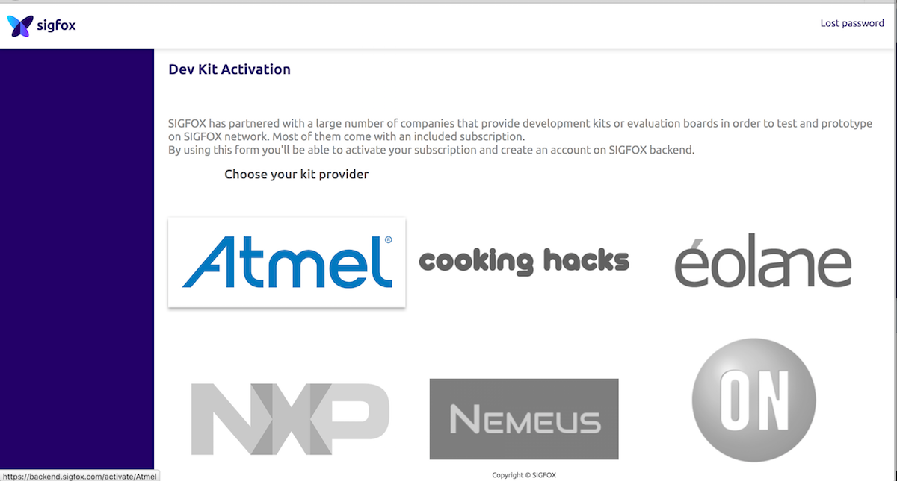
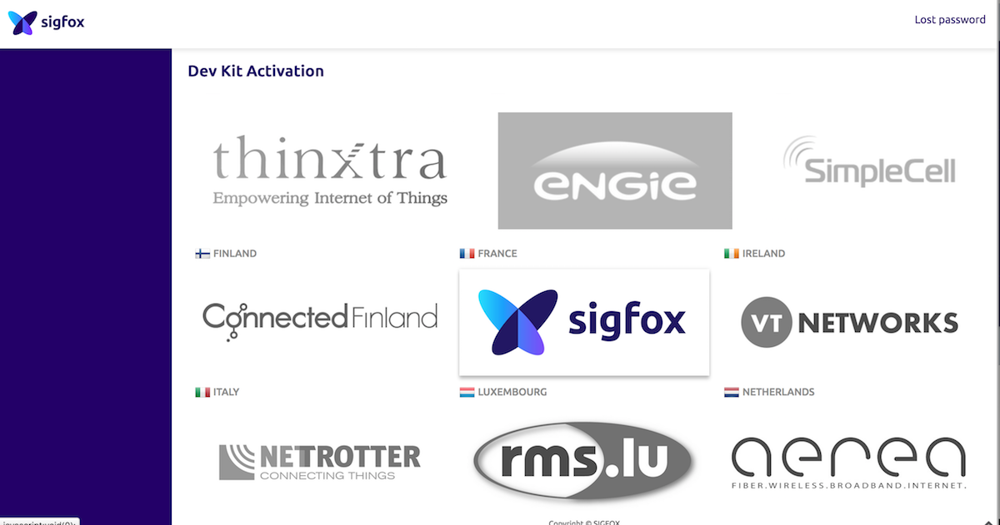
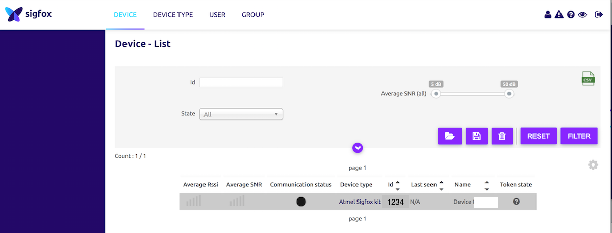
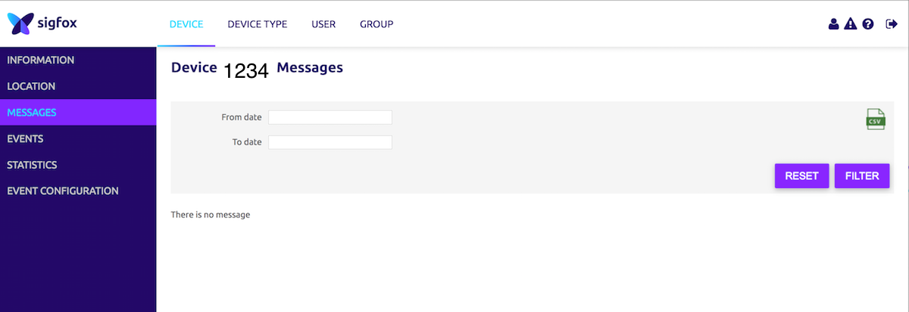
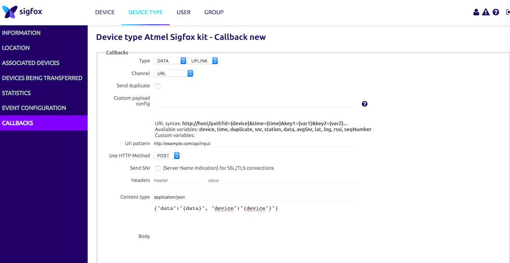

#Hackathon Usine Digitale

Basic instructions to get started with your Atmel Arduino shield, and send your first messages over Sigfox within minutes.

This is an Arduino *shield*, which means you mean an [Arduino](http://arduino.cc) board to act as its master.

##Resources

Useful resources : 

* [Sigfox developer portal](http://makers.sigfox.com)
* [This Sigfox overview on slideshare](http://www.slideshare.net/nicolsc-slides/sigfox-makers-tour-bratislava)
* [Ask Sigfox](http://ask.sigfox.com) : Sigfox Q&A platform
* Atmel documentation :
	* http://www.atmel.com/products/wireless/sigfox/default.aspx
	* http://www.atmel.com/devices/ata8520.aspx

##Register

Register your kit on [the devkit activation page](http://backend.sigfox.com/activate) 

Choose the following settings : 

* Provider : Atmel
* Operator : 🇫🇷 Sigfox

Then enter the informations related to your own device.
ID & PAC are printed on the back of the board, or you can extract them through a command

Once registered, you will receive an automated email asking you to setup your password.   
After that ... you're good to go ! Your account is ready to receive & manage the messages sent by your device

##Hello world

Simply copy the [Hello World sample sketch](./atmelhelloworld/atmelhelloworld.ino) in this repository. 

Provided with this sample, you have two Arduino librairies :

* AtmSIGFOX : abstract the interactions with the chipset to send Sigfox messages, and retrieve information from the hardware.
* AtmTemp : methods to use the included temperature sensor

###Frame composition

This example only uses 3 bytes, out of the maximum 12 bytes that can be sent over Sigfox.  
Power supply voltage in coded on the 2 last bytes, in mV.  
Temperature is sent as an integer on one byte, in °C.

####Example 

Frame sent : **000000000000000000190CA3**

* Power supply voltage
  * 00000000000000000019**0CA3**
  * 0CA316 == 323510 
  * Voltage is 3235 mV
* Temperature
  * 000000000000000000**19**0CA3
  * 1916 == 2510
  * Temperature is 25°C

##Go further

###Something more than the temperature ?

You can plug whatever analog/digital sensor you need to the board, and use its output to compose your emitted messages.

###Use your data

####Step one : check in the interface

Go to the _Devices_ section on [the sigfox portal](http://backend.sigfox.com) , click on your own device ID and then enter its _Messages_ menu.

####Step two : set a callback

* Go to the _Device Type_ menu
* Click on your device type name
* Enter the _Callbacks_ menu
* Click _new_ (hidden in the top right corner !)
* Select _Custom callback_
* Choose your settings (you can choose to push to an HTTP endpoint, or to send a email for quick debug)

##Help

We'll be on site over the weekend (Alex saturday, Nicolas friday night & sunday)

\+ feel free to contact us during the hackathon at devrelations@sigfox.com , or on twitter : [Alex @AlexRBucknall](http://twitter.com/AlexRBucknall) - [Nicolas @nlesconnec](http://twitter.com/nlesconnec)
